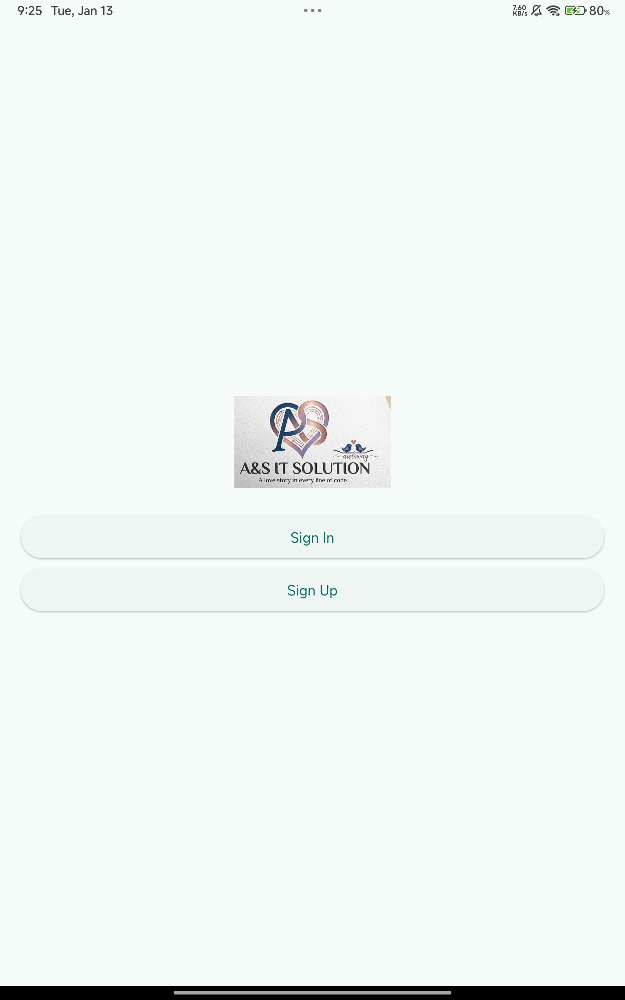
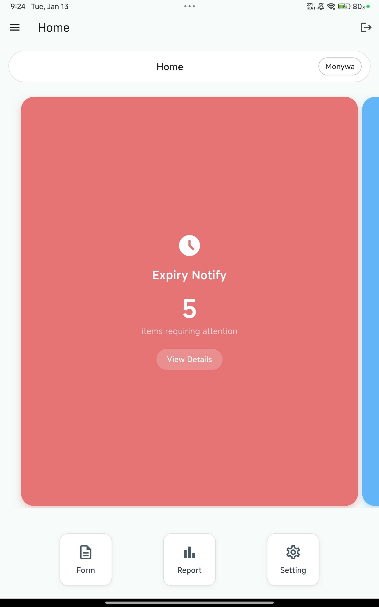
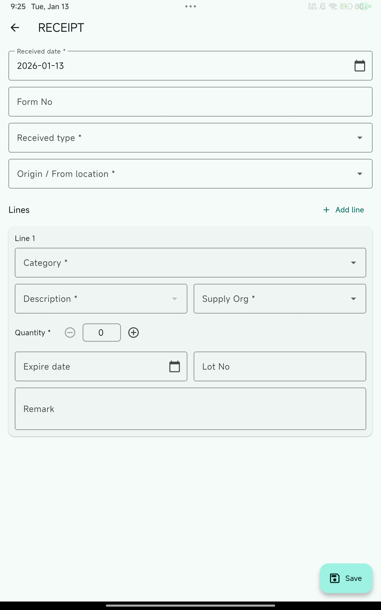
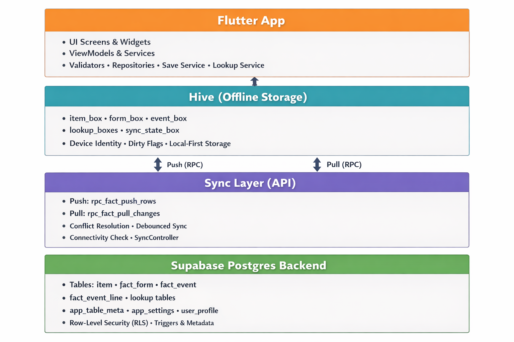

# Ansone – Portfolio Overview (Public Documentation Only)

This is the public-facing documentation of my private digital health project, **Ansone**, an offline-first clinic inventory and transaction app built with Flutter, Hive, and Supabase.

🔐 **Note:**  
The full application code is kept private, but this repository contains:

- Project overview
- Architecture documentation
- SDLC workflow
- QA approach
- Screenshots & architecture diagram
- Feature roadmap

These materials are shared for professional review (e.g., recruitment, portfolio evaluation).

# Ansone – Offline-First Inventory & Clinical Transaction App  
### *Built with Flutter • Supabase • Hive*

Ansone is an offline-first stock and clinical transaction tracking app designed for clinics operating with unreliable connectivity and multi-role workflows.

---

## 🌍 Context & Problem

- Paper-based or Excel stock ledgers frequently cause **errors, delays, and data inconsistencies**.  
- Many clinics operate with **unstable or intermittent internet**, requiring tools that work fully offline.  
- Multi-device, multi-role teams (nurse, doctor, cashier, admin) need **auditability, consistency, and secure sync** across devices.

---

## 👩‍⚕️ Who This App Is For

- Nurses  
- Doctors  
- Cashiers  
- Clinic administrators  

Designed for **Android tablets and desktop environments** used in small to medium health facilities.

---

## ⚙️ Core Features (Current MVP)

- **Receive stock** with strict batch-identity rules to prevent item mix-ups.  
- **Transaction capture** with validation and audit trails.  
- **Offline-first data** stored in local Hive boxes.  
- **Supabase-driven sync system** using:
  - `row_version`
  - `updated_at`
  - dirty-flag change tracking  
- **Metadata-driven lookups** — lookup tables dynamically defined by backend metadata (no hard-coded lists).

---

## 🏗 Architecture Overview

- **Flutter UI** interacting with **Hive** for local-first workflows.  
- **Supabase Postgres** backend with:
  - `item`
  - `fact_form`
  - `fact_event`
  - `fact_event_line`
  - lookup tables
- **Unified fact-sync engine** using RPCs for push + pull with conflict awareness.  
- **Lookup sync** at startup to keep reference data consistent across devices.  

---

## 🧩 SDLC & My Role

I served as **product owner, system analyst, and developer**, covering the entire lifecycle:

- Requirements gathering & clinic workflow analysis  
- Data model design and sync algorithm development  
- Iteration management (MVP → refactor → feature expansions)  
- Test scenario creation and **manual UAT-style testing** for every major change  

This project shows hands-on experience with **real SDLC**, not just coding.

---

## 🎯 Relevance to “Digital Initiatives Support Officer” Role

This project demonstrates capabilities aligned with the WHO Digital Initiatives Support Officer requirements:

### **Digital Product Management**
- Defined MVP, wrote backlog items, managed iterations, and continuously refined UX.

### **Bridge Between Health & IT**
- Translated actual clinic workflows (nurse → doctor → cashier → admin) into system logic, tables, and user stories.

### **Quality Assurance**
- Designed and executed test flows for:  
  - receive transactions  
  - sync behaviour  
  - offline/online transitions  
  - error handling before each release  

### **Security & Compliance Mindset**
- Implemented:
  - Supabase Row-Level Security (RLS)  
  - Soft delete logic  
  - Device identity tracking  
  - Conflict-aware sync using `row_version`  
- All aligned with expectations for digital health data handling.

---

## 🚀 How to Run (For Technical Reviewers)

1. Install **Flutter SDK**.  
2. Create a **Supabase project**.  
3. Copy `.env.example` → `.env` and add Supabase URL + anon key.  
4. Install dependencies:
   ```bash
   flutter pub get

## 📸 Screenshots

### Welcome Screen

A very first landing page of the app.

### Home Screen

Screen to land after the user is signed in.

### Receive Screen

A screen with data entry form to add received items with detail informations.
---

## 🏗 Architecture Diagram

Structure to make app offline-first, conflict managed, cross-platform use, multi-device and role based security data structure.
